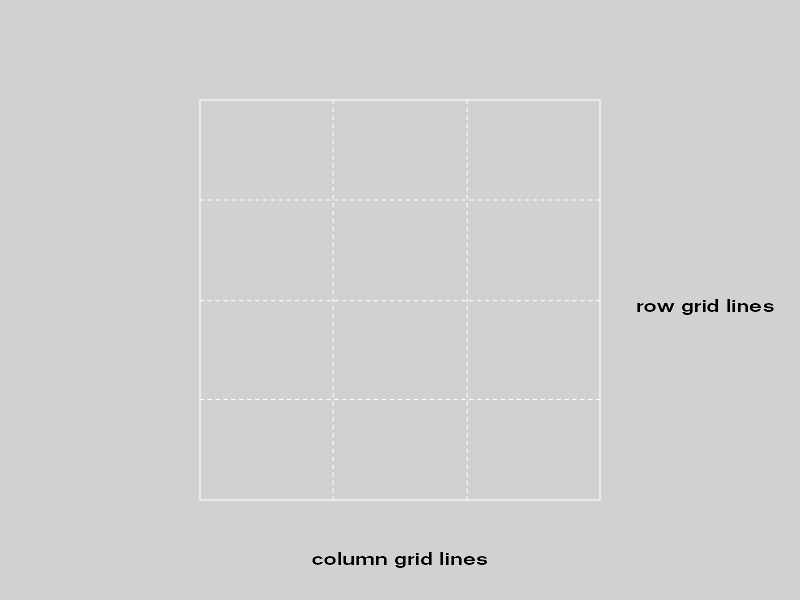
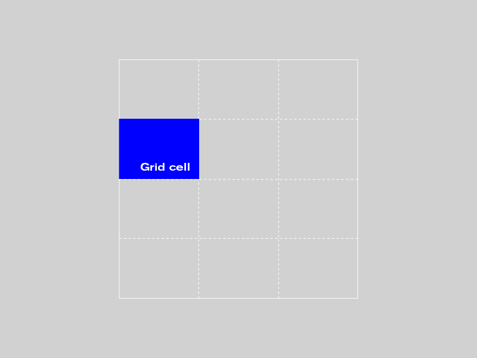
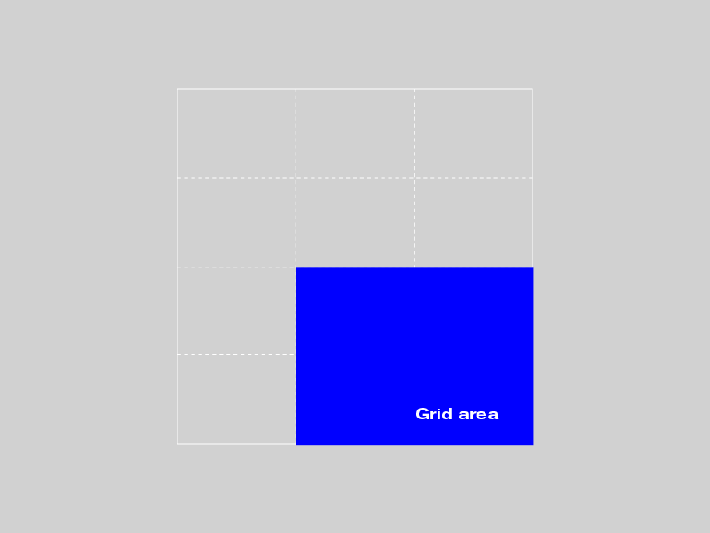
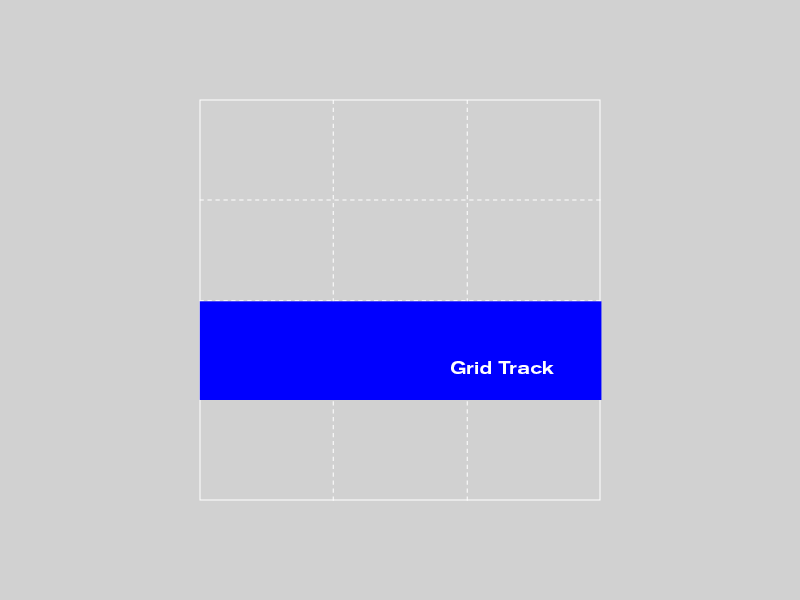
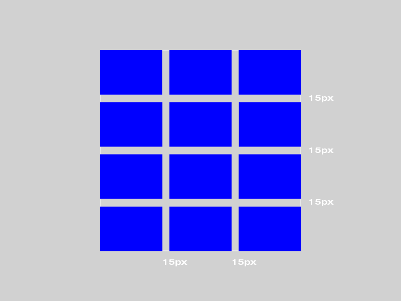
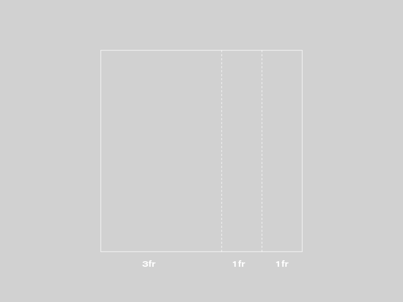

# CSS Grid

Mit CSS Grids können wir Webseiten direkt mit CSS layouten und Elemente unabhänig von ihrer Reinfolge im HTML so plaziren wie wir möcheten. Das bedeutet wir können flexible Spalten und Reihen (grid rows und grid columns) anlegen und unsere Webseiten-Elemente dann komplett frei in diesem Grid platzieren.

## CSS Grid im Überblick

Um CSS Grid anzuwenden, benötigst du ein paar neue Begriffe, die ich hier einmal in einer kleinen Übersicht zusammen gefasst habe.

#### Grid container

Der Grid Container ist der äußerste Container, in dem das Grid gebaut wird. Die CSS-Klasse für dieses HTML-Element muss display: grid heißen.

#### Grid item

Ein Grid item ist jedes Element im Grid, das direkt im Container sitzt (also nicht die Child-Elemente innerhalb von Grid items).

#### Grid line

Es gibt zwei unterschiedliche Grid lines. Die vertikalen Grid-Linien werden „columns“ genannt, die horizontalen „rows“.



#### Grid cell

Grid cell werden alle einzelnen Zellen des Grids genannt.



#### Grid area

Mehrere Zellen zusammengenommen bilden eine Grid area.



#### Grid track

Grid tracks werden alle Spalten und Reihen des Grids genannt, also der Bereich zwischen zwei Column lines oder zwei Row lines.



#### Grid gap

Die Zwischenräume zwischen den Grid rows oder columns sind die Grid gaps (sie können z.B. einen festen Pixelwert von 15px haben). Diese Spalten werden auch auch gutter genannt. Die CSS-Werte sind grid-column-gap und grid-row-gap. Wichtig ist sich zu merken, dass die Zwischenräume nur innerhalb des Grids angelegt werden und nicht an den äußeren Grid lines (bzw. am Rand des Containers).



#### Der Wert fr

fr (steht für fraction) ist ein neuer Wert, der für CSS Grid eingeführt wurde. grid-container: 1fr bedeutet, das eine Fraktion des zur Verfügung stehenden Platzes genutzt wird.
Grid template column

Du kannst deine Grid-columns z.b. so anlegen:

```
grid-template-columns: 3fr 1fr 1fr;
```

Das würde in folgendes Grid-Layout resultieren: 



#### Grid template rows

„auto“ ist hier standard und bedeutet, dass der Inhalt die Höhe der grid-row bestimmt. Du kannst aber auch feste Pixel-Maße oder einen Prozentwert angeben.

grid-template-rows: 120px 25% auto;
