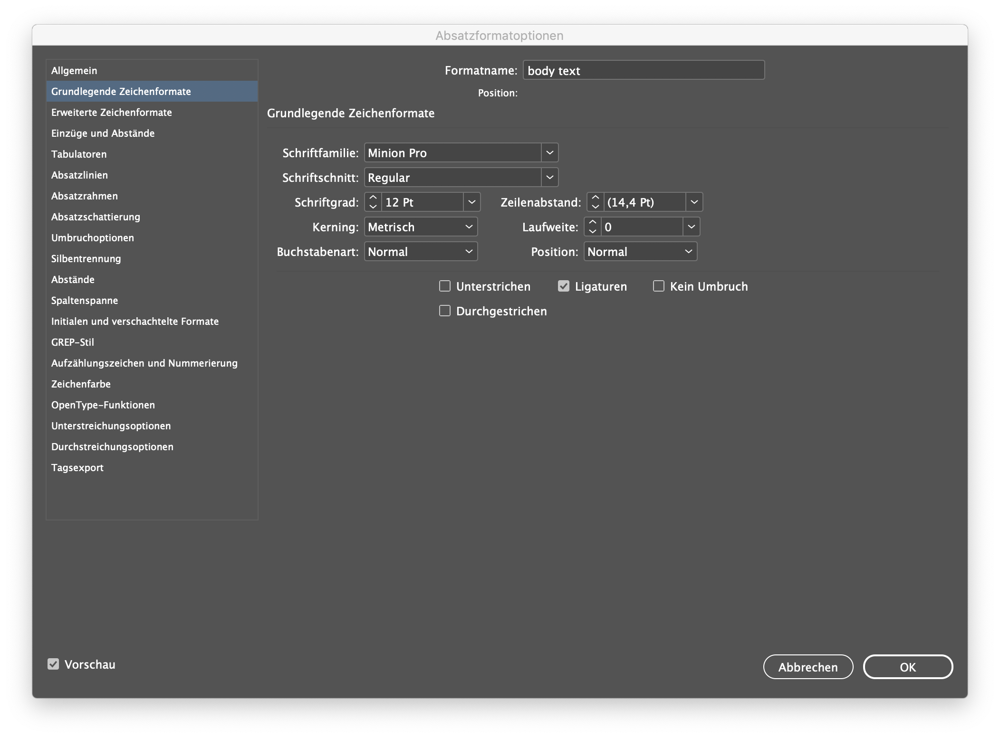
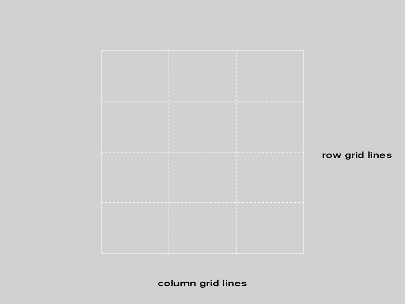
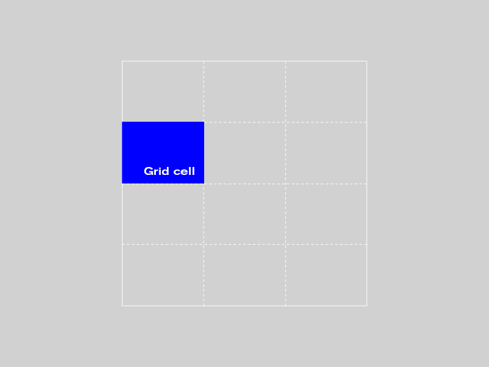
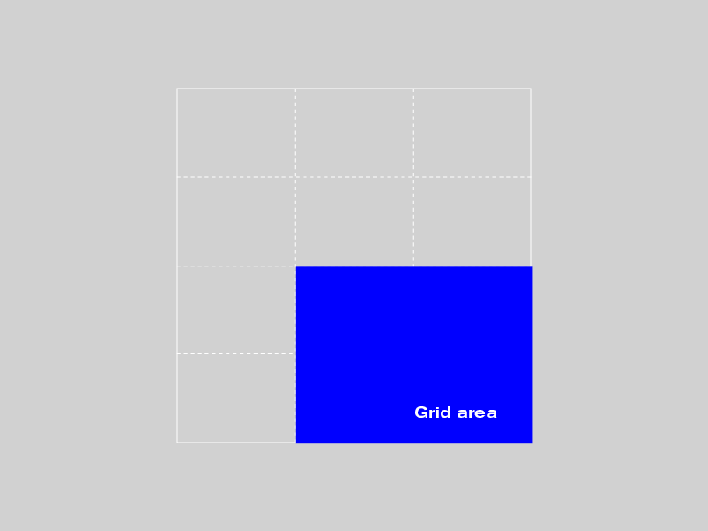
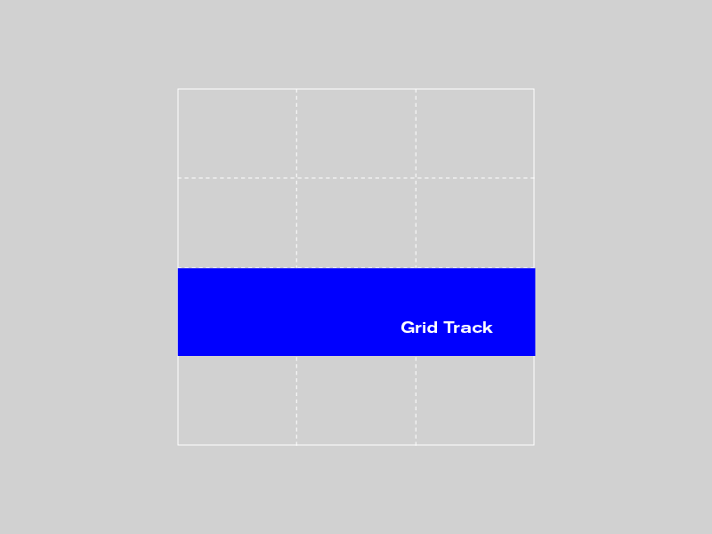
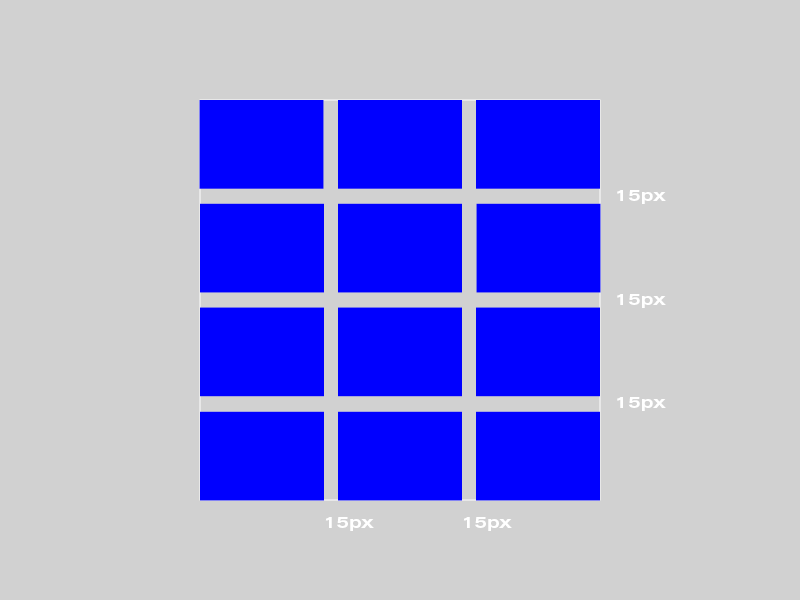
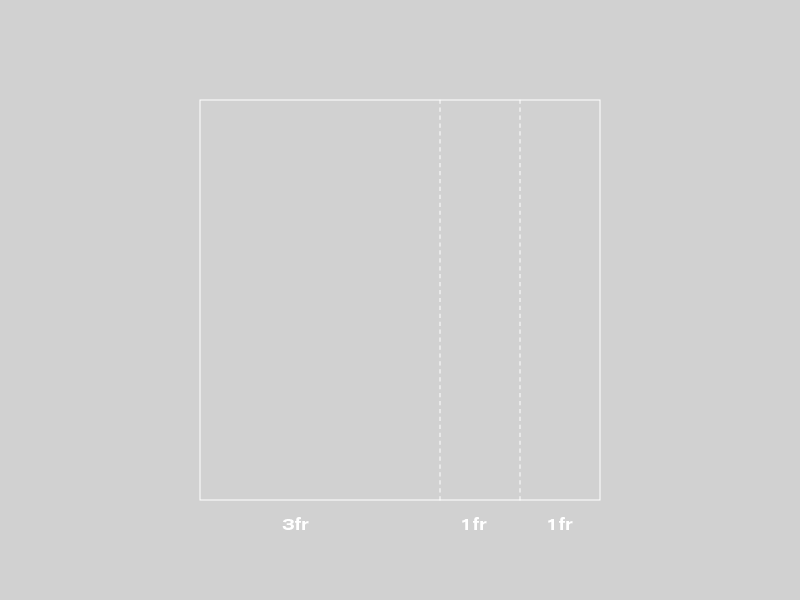
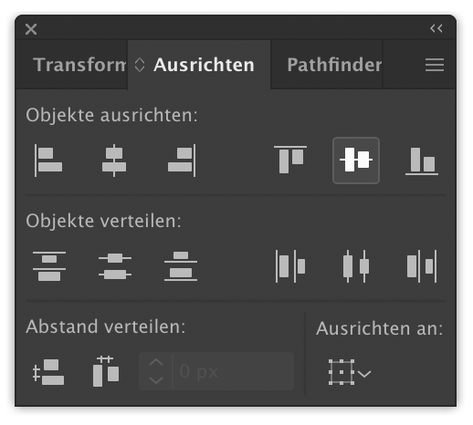

# CSS Basics

CSS ist die sprach mit der Präsentation des HTML dokuments beschrieben wird. Wenn HTML die Struktur des Inhaltes definiert, benutzen wir CSS um das aussehen der Elemente auf der Seite zu beschreiben. CSS ist vergleichbar mit dem Absatz / Zeichen / Objekt formaten in inDesign:



## Der Syntax

CSS steht für *Cascading Style Sheets*, mit der wir Elemente auf unserer Seite *Stylen* können. In CSS schreiben wir eigentlich Regeln nach denen sich der Browser richten muss um unsere Seite Anzuzeigen. 
Die Struktur dieser Regeln sieht so aus:

```
Selektor {
  Eigenschaft: wert;
  andere-eigenschaft: anderer-wert;
}
```

Der *Selektor* definiert welches Element wir verändern möchten und danach kommt eine Liste mit den Eigenschaften und dessen werten.

Weil Ein Computer nicht besonders schlau ist müssen wir dabei den Satzbau sehr genau befolgen. Um dem Computer zu sagen das Anna rote Haare haben soll würden wir also schreiben:

```
anna {
  haare: rot;
}
```

Aber wir wollen ja keine Menschen stylen sondern HTML tags. Wenn wir also die Hintergrundfarbe unsere Seite verändern wollen schreiben wir:

<iframe height='152' scrolling='no' title='CSS: Syntax' src='//codepen.io/macky/embed/dQZody/?height=152&theme-id=35174&default-tab=css,result' frameborder='no' allowtransparency='true' allowfullscreen='true' style='width: 100%;'>
</iframe>

In diesem fall wählen wir alle `<Body>` Elemente aus und setzten die Eigenschaft `background-color` auf „gold“. Wir können auch mehr Eigenschaften hinzufügen:

```
body {
  background-color: gold;
  font-family: Helvetica;
}
```

Jetzt wird der ganze Text zwischen `<body>` und `</body>` in Helvetica angezeigt.

Wie in HTML können wir Kommentare schreiben um unseren Code Lesbarer zu gestalten:

```
/* Diese CSS Regel verändert die Schriftgröße. 
Dabei ist "rem" eine Einheit die abhängt von der   
grundsätzlichen Schriftgröße. Wenn wir die noch nicht   
verändert haben bedeutet das normalerweise 16px   
(px bedeutet Pixel). 2rem währen dann also 2 x 16px = 32px */
body {
  background-color: magenta;
  font-size: 2rem;
}
```

## Classe Selektieren

Es gibt noch viele andere Selektoren neben HTML tags wie `<body>`. Du kannst auch Elemente mit einer bestimmten klasse oder id auswählen. Wenn wir also nur ein `<p>` Element zentrieren wollen können wir zuerst eine Klasse zuweisen:

```
<p class="wichtiger-text">Dieser Text wird Zentriert</p>
```

Jetzt kann ich dieses Element auswählen damit es nur diese Klasse verändert:

```
.wichtiger-text {
  text-align: center;
}
```

Hier unten kannst du dir den `HTML` und den `CSS` Code dazu anschauen:

<iframe height='137' scrolling='no' title='CSS: Selector' src='//codepen.io/macky/embed/BGmNLL/?height=137&theme-id=35174&default-tab=css,result' frameborder='no' allowtransparency='true' allowfullscreen='true' style='width: 100%;'>
</iframe>


Wichtig:
id Selektoren werden nach einem `#` geschrieben während Class Selektoren nach einem Punkt geschrieben werden – `.`

## .css Datei

CSS und HTML zu trennen macht es einfacher zu verstehen. Aber du musst daran denken dem Browser zu sagen wo die CSS Datei liegt.
Das machst du zwischen den `<head></head>` tags in deinem HTML Dokument:

```
<link rel="stylesheet" href="style.css" />

```


Jetzt kennst du die Grundlagen zu CSS:

[MDN's CSS Dokumentation](https://developer.mozilla.org/en-US/docs/Web/CSS) enthält eine umfassende Auflistung aller Eigenschaften und Werte.
Die Tutorials von Mozilla zu den [CSS Basics](https://developer.mozilla.org/en-US/docs/Learn/Getting_started_with_the_web/CSS_basics) sind ein guter Einstig.

----

# CSS Grid

Mit CSS Grids können wir Webseiten direkt mit CSS layouten und Elemente unabhänig von ihrer Reinfolge im HTML so plaziren wie wir möcheten. Das bedeutet wir können flexible Spalten und Reihen (grid rows und grid columns) anlegen und unsere Webseiten-Elemente dann komplett frei in diesem Grid platzieren.

## CSS Grid: Begriffe

Um CSS Grid anzuwenden, benötigst du ein paar neue Begriffe, die ich hier einmal in einer kleinen Übersicht zusammen gefasst habe.

**Grid container**

Der Grid Container ist der äußerste Container, in dem das Grid gebaut wird. Die CSS-Klasse für dieses HTML-Element muss display: grid heißen.

**Grid item**

Ein Grid item ist jedes Element im Grid, das direkt im Container sitzt (also nicht die Child-Elemente innerhalb von Grid items).

### Grid line

Es gibt zwei unterschiedliche Grid lines. Die vertikalen Grid-Linien werden „columns“ genannt, die horizontalen „rows“.



### Grid cell

Grid cell werden alle einzelnen Zellen des Grids genannt.



### Grid area

Mehrere Zellen zusammengenommen bilden eine Grid area.



### Grid track

Grid tracks werden alle Spalten und Reihen des Grids genannt, also der Bereich zwischen zwei Column lines oder zwei Row lines.



### Grid gap

Die Zwischenräume zwischen den Grid rows oder columns sind die Grid gaps (sie können z.B. einen festen Pixelwert von 15px haben). Diese Spalten werden auch auch gutter genannt. Die CSS-Werte sind grid-column-gap und grid-row-gap. Wichtig ist sich zu merken, dass die Zwischenräume nur innerhalb des Grids angelegt werden und nicht an den äußeren Grid lines (bzw. am Rand des Containers).



## Der Wert "fr"

fr (steht für fraction) ist ein neuer Wert, der für CSS Grid eingeführt wurde. grid-container: 1fr bedeutet, das eine Fraktion des zur Verfügung stehenden Platzes genutzt wird.
Grid template column

Du kannst deine Grid-columns z.b. so anlegen:

```
grid-template-columns: 3fr 1fr 1fr;
```

Das würde in folgendes Grid-Layout resultieren: 



### Grid template rows

„auto“ ist hier standard und bedeutet, dass der Inhalt die Höhe der grid-row bestimmt. Du kannst aber auch feste Pixel-Maße oder einen Prozentwert angeben.

grid-template-rows: 120px 25% auto;

## Grid: Box alignment

### justify-self

mit `justify-self` können wir Elemente die kleiner wie unser Grid sind Horizontal verteilen

[Beispiel Vollbild](https://codepen.io/macky/full/rQYWgR/)

<iframe height='400' scrolling='no' title='Grid by Example 27: justify-self' src='//codepen.io/macky/embed/rQYWgR/?height=791&theme-id=35174&default-tab=result' frameborder='no' allowtransparency='true' allowfullscreen='true' style='width: 100%;'>
</iframe>

### align-self

mit `align-self` können wir Elemente die kleiner wie unser Grid sind Vertical verteilen


[Beispiel Vollbild](https://codepen.io/macky/full/eQegYX/)

<iframe height='300' scrolling='no' title='Grid by Example 26: align-self' src='//codepen.io/macky/embed/eQegYX/?height=300&theme-id=35174&default-tab=result' frameborder='no' allowtransparency='true' allowfullscreen='true' style='width: 100%;'>
</iframe>


## Beispiele

### Tiefe erzeugen mit z-index

<iframe height='414' scrolling='no' title='CSS: Grid depth' src='//codepen.io/macky/embed/jQarad/?height=414&theme-id=35174&default-tab=css,result' frameborder='no' allowtransparency='true' allowfullscreen='true' style='width: 100%;'>.
</iframe>

[auf Thimble bearbeiten](https://thimbleprojects.org/gress/572263)
<br>

### Responsive Grid

<iframe height='399' scrolling='no' title='CSS: Grid implicid' src='//codepen.io/macky/embed/zMPBjr/?height=399&theme-id=35174&default-tab=css,result' frameborder='no' allowtransparency='true' allowfullscreen='true' style='width: 100%;'>.
</iframe>

[auf Thimble bearbeiten](https://thimbleprojects.org/gress/572266)

### Responsive Grid 2

<iframe height='419' scrolling='no' title='CSS: Grid Implicid Text' src='//codepen.io/macky/embed/MzOjYK/?height=419&theme-id=35174&default-tab=result' frameborder='no' allowtransparency='true' allowfullscreen='true' style='width: 100%;'>
</iframe>

[auf Thimble bearbeiten](https://thimbleprojects.org/gress/572267)

## Additional resources

[unter Ressourcen -> Grid](ressourcen/#css-grid)


# CSS Extended

## CSS: Units

### Units Types

```
* {
    /* absolute units */
    width: 100px;      /* pixels */

    /* physical units */
    /* (not suitable for screen display) */
    font-size: 12pt;   /* points */
    font-size: 1pc;    /* picas == 12pt */
    width: 5mm;        /* millimeters */
    width: 1.2cm;      /* centimeters */
    width: 0.5in;      /* inches */

    /* relative units */
    height: 20%;       /* percent of parent size */
    padding: 1.5em;    /* 1em == current font size */
    font-size: 1.5rem; /* root em: base font-size on body-level */
    height: 50vh;      /* % of the viewport height */
    width: 50vw;       /* % of the viewport width */

    /* unit-less */
    padding: 0;        /* if 0, no unit is needed */
    line-height: 1.5;  /* is the same as 150% or 1.5em in this case */
    opacity: 0.5;
}
```
### Unit: Colors

```
* {
    color: green;                     /* named color */
    color: rgb(255, 0, 0);            /* RGB values */
    color: rgb(255, 0, 0, 0.5);       /* RGB values + alpha */
    color: #FF0000;                   /* hexadecimal RGB */
    color: hsl(240, 100%, 50%);       /* hue, saturation, lightness */
    color: hsla(240, 100%, 50%, 0.5); /* HSL + alpha */
}
```

### Additional resources

[MDN über Values und Units](https://developer.mozilla.org/en-US/Learn/CSS/Introduction_to_CSS/Values_and_units)

---

## CSS: Backgrounds

### Background color

```
* {
    background-color: rgb(255, 40, 0);
}
```

### Background images

```
* {
    background-image: url(http://lorempixel.com/1024/768/cats/);

    /* optionally, you can specify if the background image should
    repeat or not ... */
    background-repeat: no-repeat;

    /* ... and how it should be positioned */
    background-position: center center;
}
for fullscreen backgrounds you would do:

* {
    background-image: url(http://lorempixel.com/1024/768/cats/);
    background-repeat: cover; /* cover the entire ares of the element */
}

```


**relevant CSS properties:**

- background-image
- background-repeat
- background-position
- background-attachment

### Gradients

[CSS Gradients auf CSS Tricks](https://css-tricks.com/css3-gradients/)


<iframe height='300' scrolling='no' title='CSS: Background' src='//codepen.io/macky/embed/PxJrbQ/?height=300&theme-id=35174&default-tab=css,result' frameborder='no' allowtransparency='true' allowfullscreen='true' style='width: 100%;'>
</iframe>

---

## CSS: Basic typography

these are the most important typography-related CSS properties:

- color
- font-size
- font-style
- font-variant
- font-weight
- letter-spacing
- word-spacing
- line-height
- text-align
- text-decoration
- text-indent
- text-transform

<iframe height='570' scrolling='no' title='CSS: Typography' src='//codepen.io/macky/embed/bQoJWG/?height=570&theme-id=35174&default-tab=css,result' frameborder='no' allowtransparency='true' allowfullscreen='true' style='width: 100%;'>
</iframe>
<iframe height='1447' scrolling='no' title='CSS: Typography paragraph' src='//codepen.io/macky/embed/WYZBNR/?height=1447&theme-id=35174&default-tab=css,result' frameborder='no' allowtransparency='true' allowfullscreen='true' style='width: 100%;'>
</iframe>

### Additional resources

- [MDN Einführung Typografie](https://developer.mozilla.org/en-US/docs/Learn/CSS/Styling_text/Fundamentals)
- [The Elements of Typographic Style Applied to the Web](http://webtypography.net/)

---

## CSS: Effects

### Opacity


die `opacity` property verändert die Deckkraft von Elementen. Dabei steht `0` für Transparent und `1` für voll deckend.

<iframe height='300' scrolling='no' title='CSS: Opacity' src='//codepen.io/macky/embed/yQPNjE/?height=300&theme-id=35174&default-tab=css,result' frameborder='no' allowtransparency='true' allowfullscreen='true' style='width: 100%;'>
</iframe>

### Drop shadows

in CSS werden Schatten mit `box-shadow` und `text-shadow` gemacht.

<iframe height='300' scrolling='no' title='CSS: Box Shadow' src='//codepen.io/macky/embed/BGwXOy/?height=300&theme-id=35174&default-tab=css,result' frameborder='no' allowtransparency='true' allowfullscreen='true' style='width: 100%;'>
</iframe>

### Filter

mit der `filter` property, kannst du einen (oder mehrere) Photoshopartige Filter auf ein Element anwenden.

<iframe height='300' scrolling='no' title='CSS: Filter' src='//codepen.io/macky/embed/VVrLGv/?height=300&theme-id=35174&default-tab=css,result' frameborder='no' allowtransparency='true' allowfullscreen='true' style='width: 100%;'>
</iframe>

### Additional resources

[CSS3 Box Shadow Generator](https://css3gen.com/box-shadow/)
[CSS3 Text Shadow Generator](https://css3gen.com/text-shadow/)
[CSS Tricks über Filter](https://css-tricks.com/almanac/properties/f/filter/)

---

## CSS: 3D Transforms

### Additional resources

[Einführung zu CSS 3D transforms](http://desandro.github.io/3dtransforms/)


---
## CSS: Flexbox

CSS Flexbox ist ein Mächtiges Werkzeug um Elemente anzuordnen und zu verteilen. Es ist vergleichbar mit dem Ausrichten Fenster in Illustrator und Photoshop:



Flexbox Macht es besonders einfach Elemente [Horizontal und Vertikal](https://philipwalton.github.io/solved-by-flexbox/demos/vertical-centering/) anzuornen.

### Beispiel

<iframe height='300' scrolling='no' title='CSS: Flexbox power' src='//codepen.io/macky/embed/ZmaQNX/?height=300&theme-id=35174&default-tab=result' frameborder='no' allowtransparency='true' allowfullscreen='true' style='width: 100%;'>
</iframe>

[auf Thimble bearbeiten](https://thimbleprojects.org/gress/588884/)

### Additional resources

- [Flexbox Froggy](http://flexboxfroggy.com/)
- [A Complete Guide to Flexbox](https://css-tricks.com/snippets/css/a-guide-to-flexbox/)
- [Solved by flexbox](https://philipwalton.github.io/solved-by-flexbox/)

---

## CSS: Responsive

### Responsive design

Wir benutzen Heute ein ganzes Spektrum an verschiedenen Geräten um das Internet zu benutzen: von Handys und Tablets bis hin zu Gigantischen 5k Monitoren. Deswegen müssen sich auch unsere Webseiten anpassen und auf das Gerät reagieren (also responsive sein) um überall gut auszusehen. 

### Media queries

CSS erlaubt uns informationen zu erhalten über das Medium auf dem es angezeigt wird zu erhalten. Wie die Auflösung, Pixel denssity oder Ausrichtung. Mit sogenanten Media Queries können wir abhängig von unserem Output Medium gestalten.

Wir könnten also z.B. unsere Schriftgröße auf Handys etwas Größer machen oder das Layout etwas einfacher gestalten. Oder andersrum auf größeren Bildschirmen z.B. zusätzliche informationen darstellen oder mehr Weißraum lassen.

Media Queries beginnen mit `@media`, gefolgt von den angaben nachdenen es auswählen soll. Wenn die Angaben zutreffen wird der gesamte CSS code zwischen den geschweiften klammern angewandt:

```
/* Für jeden Bildschirm kleiner als 600px
 wird das .sidebar Element versteckt */
@media (max-width: 600px) {
    .sidebar {
        display: none;
    }
}
```


### Beispiel


<iframe height='425' scrolling='no' title='CSS: Responsive' src='//codepen.io/macky/embed/dQVxQw/?height=425&theme-id=35174&default-tab=css,result' frameborder='no' allowtransparency='true' allowfullscreen='true' style='width: 100%;'>
</iframe>

[auf Thimble bearbeiten](https://thimbleprojects.org/gress/588890/)

### Tip: "Bildschirmgrößen testen"

Die Meisten Browser erlauben es verschiedene bildschirmgrößen und Geräte zu simulieren: [Bildschirmgröße testen in Firefox](https://developer.mozilla.org/de/docs/Tools/bildschirmgroessen-testen)

> - Wählen Sie "Bildschirmgrößen testen" vom Web-Entwickler-Untermenü im Firefox-Menü (oder Extras-Menü, wenn die Menüleiste aktiviert ist oder Sie Mac OS X benutzen) aus
> - Klicken Sie auf die Schaltfläche "Bildschirmgrößen testen" in der Symbolleiste der  Werkzeugleiste.


### Additional resources

[vollständige Liste der Media Features](https://developer.mozilla.org/en-US/docs/Web/CSS/Media_Queries/Using_media_queries#Media_features)