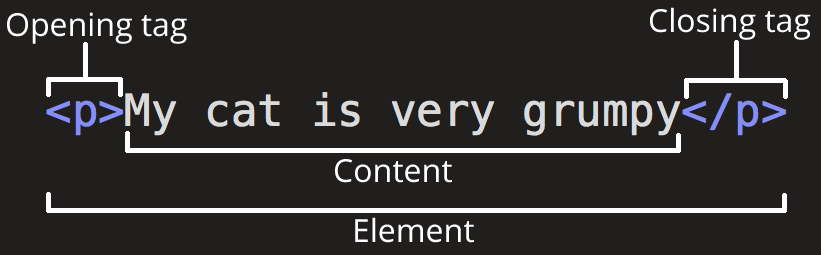
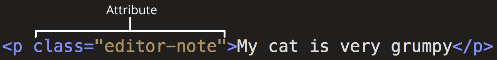

## Kleine Einführung zu HTML

HTML steht für HyperText Markup Language. Mit HTML können wir Inhalte definieren. Das Resultat von HTML ist nicht schön - die meisten browser benutzen standardmäßig Times New Roman als Schrift und blau unterstrichene links - aber die Möglichkeit Inhalte zu einer Seite hinzuzufügen die jeder auf der Welt sehen kann ist sehr mächtig! Nachdem du die Grundlagen von HTML verstanden hast, kannst du mit CSS experimentieren um die Gestaltung zu verändern. 

Das erste was man in einem HTML Dokument normalerweise sieht ist das "doctype":

```
<!DOCTYPE html>
```
Der doctype sagt dem Browser, dass ab jetzt HTML code kommt. Als nächstes kommt meistens das:

```
<html>
```

Das ist ein **Tag** – HTML benutzt tags, die den Inhalt wie ein Sandwich zusammenhalten. Diese "Sandwiches" nennen wir auch **Elemente**. So sieht z.B. ein Absatz Element aus:

```
<p>This is a paragraph!</p>
```
Der Inhalt beginnt mit einem `<p>`tag und endet mit einem `</p>` tag, damit der Browser weiß wo der Absatz anfängt und aufhört. (dabei steht `<p>` für "Paragraph" also Absatz)



Die Meisten HTML Dokumente beginnen mit einem `<html>` tag und enden mit einem `</html>` tag.

In einem HTML Dokument existieren ein "head" und ein "Body" – im *head* stehen die Informationen für den Browser und im *Body* stehen die Inhalte für die Menschen die die Seite später anschauen.

Eine grundsätzliche Struktur die du oft sehen wirst ist also:

```
<!DOCTYPE html>
<html>
<head>
  <title>Das ist der Titel den du oben im Browser sehen kannst</title>
</head>

<body>
  
  <p>Das ist eine Absatz</p>
  
</body>
</html>
```

Lehrzeichen und Absätze im HTML sind für den Browser egal. Abgesehen zwischen einem einfachen Lehrzeichen zwischen Wörtern werden alle ignoriert.
Diese beiden Beispiele sehen im Browser später beide gleich aus:

```
<p>Das ist eine Absatz</p>
```

```
<p>
  Das ist eine Absatz
</p>
```
Du kannst also auch Zeilenumbrüche nutzen um deinen Code mehr Luft zu geben und lesbarer zu machen. 


Eine anderer weg deinen Code Lesbarer zu machen ist mit Kommentaren:

```
<!-- Das ist ein Kommentar – der Browser zeigt es nicht an -->
<h1>Das ist eine Überschrift!</h1>
```
---
Vergiss nicht, das deine Tags immer geschlossen werden müssen, sonst denkt der Browser deine Seite besteht nur aus einem einzigen tag:

<iframe height='300' scrolling='no' title='HTML: close tags' src='//codepen.io/macky/embed/RqLdxx/?height=300&theme-id=35174&default-tab=html,result' frameborder='no' allowtransparency='true' allowfullscreen='true' style='width: 100%;'>.
</iframe>


Manche Elemente haben keinen abschließenden Tag sondern sind *selbst-schließend*, wie z.B. `<br>` für einen Zeilenumbruch:


<iframe height='180' scrolling='no' title='HTML: p' src='//codepen.io/macky/embed/KrXJYx/?height=300&theme-id=35174&default-tab=html,result' frameborder='no' allowtransparency='true' allowfullscreen='true' style='width: 100%;'></iframe>

### Attribute



Und dann gibt es da noch die Elemente die mehr Informationen enthalten sollen bevor sie darstellt werden können, diese Informationen nennen wir **Attribute**. Attribute haben immer einen Namen und einen Wert:

```
<p class="Einführung">Das ist ein Absatz!</p>
```

Dieses Attribut nennt sich **Klasse* und sein wert ist *Einführung*. Wir benutzten Attribute wie `id` und `class` um unsere kleinen HTML Sandwiches mit CSS zu verändern. 
Manche Attribute sind notwendig in HTML wie z.B. bei Bildern:

```

```
Der Bild tag `` erwartet zwei Attribute: `src` benötigt einen Adresse zu dem Bild und `alt` enthält als wert den text der angezeigt wird wenn das Bild nicht geladen werden kann oder jemand das Bild nicht sehen kann – z.B. wenn sich ein Blinder die Seite mit einem Screenreader vorlesen lässt 

Die mächtigste Funktion des Web ist die Möglichkeit zu anderen HTML Dokumenten zu verlinken. Um einen Text zu einem Link werden zu lassen verpacken wir den Text in ein `a`tag und liefern die Adresse als `href` Attribut:


```
<a href="css.html">Es geht weiter mit CSS</a>
```


## Jetzt kennst du die Grundlagen zu HTML

Aber das praktische am Web sind auch die ganzen Ressourcen um neues zu Lernen. Das Thema oder einzelne Tags zu Googeln funktioniert meistens sehr gut. Mozilla [HTML Dokumentation](https://developer.mozilla.org/en-US/docs/Web/HTML) enthält auch viele vertiefende Informationen zusammen mit Tutorials.

Als nächstes Lernen wir über Cascading Stylesheets (CSS):

<a href="./css.html">Es geht weiter mit CSS</a>

# Anhang
### Nützliches HTML Grundgerüst

```
<!doctype html>
<html lang="de">
  <head>
    <meta charset="utf-8">
    <meta name="viewport" content="width=device-width, initial-scale=1.0">
    <title>Beschreibung der Seite (erscheint in der Titelzeile des Browsers</title>
    <link rel="stylesheet" href="style.css">
  </head>
  <body>
    <p>Dieser Text wird im Browserfenster angezeigt.</p>
  </body>
</html>
```

### ein paar HTML Elemente


<iframe height='684' scrolling='no' title='HTML: Examples' src='//codepen.io/macky/embed/YRrgOY/?height=684&theme-id=35174&default-tab=html,result' frameborder='no' allowtransparency='true' allowfullscreen='true' style='width: 100%;'></iframe>

Inline Elemente:

<iframe height='318' scrolling='no' title='HTML: Example inline' src='//codepen.io/macky/embed/bQoZOZ/?height=318&theme-id=35174&default-tab=html,result' frameborder='no' allowtransparency='true' allowfullscreen='true' style='width: 100%;'></iframe>